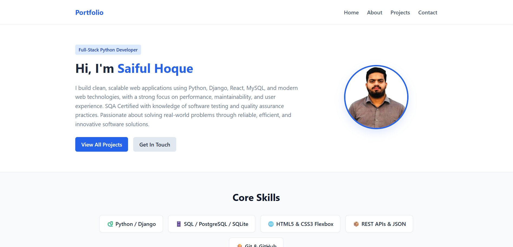
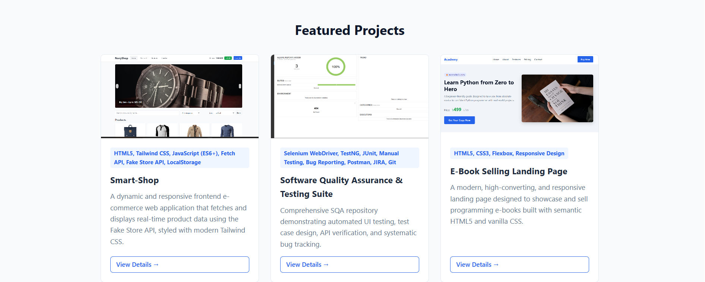
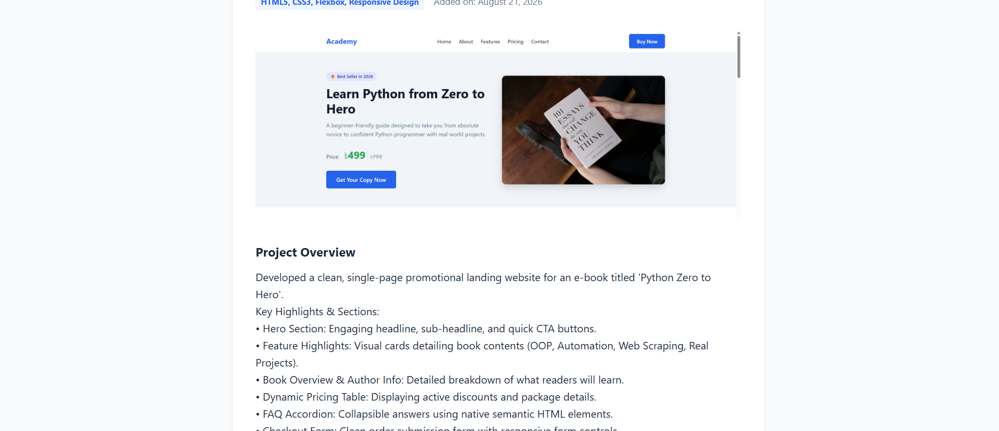

# 🚀 Personal Portfolio Website (Django)

A dynamic and responsive personal portfolio web application built with Python, Django, HTML5, and CSS3. The project demonstrates the core Django architecture (**Model → View → URL → Template**) along with CRUD management via the Django Admin interface.

---

## 📌 Project Overview
This project serves as a showcase for academic, open-source, and personal development projects. It features dynamic routing for individual project detail pages, categorized skill badges, direct GitHub repository links, and dedicated About and Contact sections.

---

## ✨ Features
- **Dynamic Home Page:** Displays a personal introduction, core skill cards, and recent featured projects.
- **Projects Catalog:** Retrieves project records dynamically from an SQLite database using Django ORM.
- **Individual Project Detail Pages (`/projects/<id>/`):** Dedicated views showing full project descriptions, technology stacks, creation dates, and repository links.
- **Django Admin Management:** Full CRUD operations to add, edit, and delete project entries and metadata.
- **Bonus Pages:** Dedicated About Me and Contact pages with social links.
- **Responsive Layout:** Clean, mobile-friendly interface designed purely with CSS3 Flexbox without third-party CSS frameworks.

---

## 🛠️ Technologies Used
- **Backend Framework:** Python 3.x, Django 6.x
- **Database:** SQLite3
- **Frontend:** HTML5 (Semantic elements), CSS3 (Flexbox & Responsive Design)
- **Media Processing:** Pillow (for handling project images)
- **Tools & Platforms:** Git, GitHub, VS Code

---

## 📸 Screenshots

### 1. Home Page & Hero Section


### 2. Projects Catalog Page


### 3. Project Detail View


---

## ⚙️ Installation & Local Setup Instructions

To run this project locally on your machine, follow these steps:

### 1. Clone the repository
```bash
git clone - https://github.com/Saiful-hoque/Portfolio
cd django-portfolio

Install required dependencies-  pip install django pillow

Apply database migrations- python manage.py makemigrations
                           python manage.py migrate

Create a Superuser (For Admin Access)  - python manage.py createsuperuser

the local development server - python manage.py runserver
